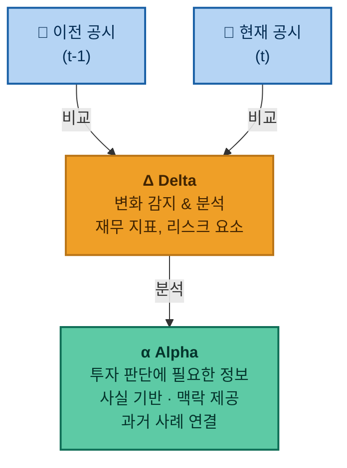
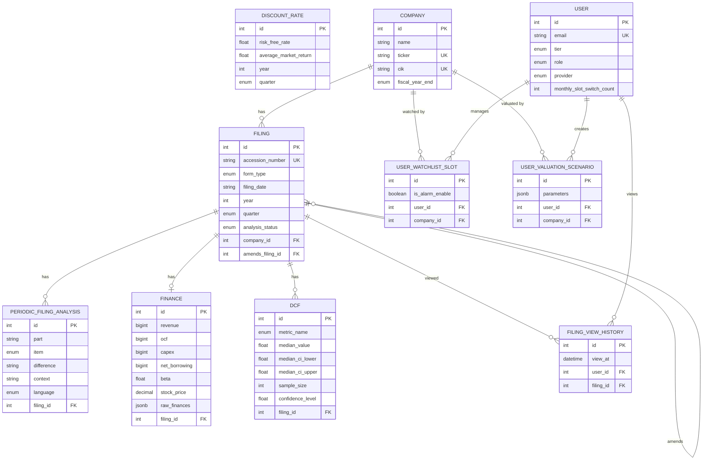

# 📈 AlpahDelta

> **Alpha from Delta**
> "SEC 공시의 변화(Δ)를 분석해 투자자가 스스로 판단할 수 있는 맥락을 제공하고, 시장수익률(β)을 넘는 초과수익(α)을 추구하는 서비스입니다.".

AlpahDelta는 미국 상장기업의 SEC 공시를 기반으로, 단순한 공시 요약을 넘어 이전 공시와 무엇이 달라졌는지(Delta)를 분석하는 것을 목표로 시작한 프로젝트입니다.
정보 제공자가 투자 판단을 대신하는 것이 아니라, 원본 공시의 사실과 과거 데이터를 바탕으로 투자자가 직접 판단할 수 있도록 돕는 것을 목표로 합니다.


<br>
<br>


## 1. 프로젝트 배경


주식시장에는 뉴스, 커뮤니티, 유튜브, 리포트 등 이미 가공된 투자 정보가 매우 많습니다.

하지만 이러한 정보는 정보를 전달하는 과정에서 작성자의 해석과 관점이 포함될 가능성이 매우 높습니다. 반면 SEC 공시는 기업이 공식적으로 제출한 1차 자료이지만, 정기 공시는 매년/매분기마다 제출하기 때문에 양이 매우 많고 이전 분기와 직접 비교하기도 어렵기 때문에 개인 투자자가 지속적으로 분석하기에는 높은 시간 비용이 발생합니다.

따라서 AlpahDelta는 이 문제를 다음과 같이 해결하는 것을 목표로 합니다.
- 현재 공시와 이전 공시의 차이점을 탐지
- 공시 원문을 기반으로 사실 중심의 정보 제공
- 현재 발생한 변화와 유사했던 과거 사례를 연결
- 재무 데이터를 기반으로 투자 분석에 필요한 기본 데이터 제공


<br>
<br>


## 2. 핵심 아이디어

AlpahDelta의 이름은 다음과 같은 개념에서 출발했습니다.



따라서 서비스의 핵심은 단순히 "이번 분기에 무엇이 있었는가"를 요약하는 것이 아니라,

> **"지난번과 비교해서 무엇이 달라졌는가?"**

를 찾아내는 것입니다.


<br>
<br>


## 3. 주요 기능

### 3.1 공시 변화 탐지

SEC 정기 공시를 이전 분기 공시와 비교하여 변경된 내용을 탐지합니다.

MD&A, Risk Factors 등 핵심 섹션에서 문구의 추가·삭제·수정을 감지하고,
사용자가 중요한 변화를 빠르게 파악할 수 있도록 시각화하여 제공합니다.

### 3.2 사실 중심의 공시 요약

매수·매도 추천 대신, 공시에 실제로 기재된 사실과 수치에 집중하여 분석합니다.

각 분석 결과에는 공시 연도, 분기, 섹션, 원문 위치를 함께 제공하여
사용자가 출처를 직접 확인하고 판단할 수 있도록 합니다.

### 3.3 과거 사례 기반 맥락 제공

현재 공시에서 감지된 변화와 유사한 사례를 대상 기업·경쟁사·동종 기업에서 검색하여,
과거에 유사한 변화가 있었을 때 어떤 결과가 나타났는지 함께 제공합니다.

단순한 정보 전달을 넘어, 투자자가 현재 변화의 의미를 스스로 해석할 수 있도록
실제 사례를 근거로 맥락을 제공하는 것을 목표로 합니다.

### 3.4 재무 데이터 추출 및 DCF 변수 조절

재무제표에서 OCF, CapEx, CAPM 등 DCF 분석에 필요한 핵심 지표를 자동으로 추출합니다.

미래 재무 데이터는 부트스트랩 기반 구간 추정으로 예측하며,
주요 변수를 슬라이더로 직접 조정하면 대략적인 적정 주가 범위를 확인할 수 있습니다.

### 3.5 공시 자동 수집 및 캐싱

여러 기업의 정기 공시를 지속적으로 모니터링하여 업데이트를 자동으로 감지하고,
분석 결과를 DB에 저장합니다.

이미 분석된 공시는 LLM 재호출 없이 저장된 결과를 반환하여 API 비용과 응답 시간을 줄입니다.
또한 조회 빈도가 높은 기업의 데이터는 캐시에 우선 저장하여 빠른 응답을 제공합니다.


<br>
<br>


## 4. 기술적 구현

### 4.1 공시 변화 탐지 & 4.2 사실 중심의 공시 요약

10-K, 10-Q 등 정기 공시는 분량이 매우 많습니다. 공시 전체를 LLM에 입력하면
분석 품질이 낮아지고 API 비용도 급격히 증가합니다.

이를 해결하기 위해 다음과 같은 단계로 분리하여 처리합니다.

1. **공시 분리**: 현재 분기·직전 분기·직전 연도·전전 연도의 공시를 item 단위로 분리합니다.
2. **1차 해시 비교**: 각 item을 단방향 해시로 변환하여 현재 분기와 과거 3개 시점을 비교합니다.
   해시값이 다른 item만 변화가 있다고 판단합니다.
3. **세부 청크 분리**: 변화가 감지된 item에 한해, 분석 품질과 비용의 균형을 고려한
   적정 단위(예: 3,000자, 5문단)로 세부 내용을 재분리합니다.
4. **2차 해시 비교**: 3단계에서 나온 청크를 동일한 방식으로 다시 해시 비교하여
   실제로 내용이 달라진 청크만 추려냅니다.
5. **정밀 Diff 추출**: 변화가 확인된 청크에 대해 삭제·추가·수정·유지를 구분하여
   정밀 diff를 생성합니다. (`difflib.SequenceMatcher` 또는 `unified_diff` 사용)
6. **출처 저장**: 분석 결과에 공시 연도·분기·섹션·원문 위치를 함께 저장하고
   조회 가능한 상태로 관리합니다.


### 4.3 과거 데이터 기반 맥락 제공

변화가 감지된 item당 1회의 API 요청으로 처리합니다.
각 item에서 삭제·추가·수정된 텍스트만 선별하여 입력합니다.

유사 사례는 다음 우선순위로 검색합니다.

1. **분석 대상 회사**의 과거 유사 사건
2. **경쟁사**의 과거 유사 사건
3. **동종 산업군** 회사의 과거 유사 사건
4. **타 산업군**에서 구조적으로 유사하게 발생한 사건

각 사례에 대해 현재 사건과의 차이점, 당시 대응 방식, 비즈니스 및 FCFE에 미친 영향을
사실 기반으로 제공합니다.

#### 프롬프트
```
# 역할
너는 기업 공시의 변경점(Diff)과 가장 일치하는 '역사적 사실(Historical Fact)'을 찾아내어 대조군 데이터를 제공하는 정밀 데이터 매칭 엔진이다. 주관적 판단이나 리스크 평가는 철저히 배제하고, 오직 사실만 기술하라.

# 입력 데이터
- 대상 회사: {회사명}
- 공시 변경 사항(Diff): {텍스트}

# 임무 (우선순위 가이드라인)
아래 1~4순위 중 **가장 명확한 역사적 데이터가 존재하는 상위 1~2개의 케이스만 선별**하여 대조 데이터를 작성하라. 만약 해당 순위의 유사 사건 데이터가 존재하지 않거나 불확실하다면, 억지로 지어내지 말고 "데이터 없음"으로 표기하라.

1순위: [대상 회사]의 과거 유사 사건 데이터
2순위: [경쟁사]의 과거 유사 사건 데이터
3순위: [동종 산업군]의 과거 유사 사건 데이터
4순위: [타 산업군]에서 구조적으로 유사하게 발생한 사건 데이터

# 출력 포맷 (오직 데이터만 제공)
## 매칭된 역사적 사례: [사례명 명시 (예: 2021년 X사의 Y 사건)]
- **현재 사건과의 차이점:** [과거 사건과 현재 Diff의 정량적/정성적 차이만 팩트 기반 기술]
- **과거 회사의 대응:** [당시 그 회사가 취한 구체적 조치]
- **비즈니스 및 재무 영향 결과:** [당시 그 사건 이후 매출/비용 변동 및 최종 결과의 수치적 또는 방향성 변화 결과]
```


### 4.4 재무 데이터 추출 및 DCF 변수 조절 슬라이더

최근 20개 분기의 매출, OCF, CapEx, 순차입금 변화를 QTD 기준으로 수집하고,
부트스트랩을 이용하여 각 항목의 변화율 구간을 추정합니다.

FCFE 기반 DCF를 MVP로 정의하며, FCFE, CAPM 할인율, TV 등의 값을 자동으로 계산하여 저장합니다.

**시작점 정의**: 현재 시가총액은 CAPM으로 산출한 할인율 $r_e$%, 영구 성장률 $g$%일 때
FCFE가 매년 성장하는 것을 반영한 주가라는 전제에서 출발합니다.

사용자는 슬라이더로 주요 변수를 직접 조정할 수 있으며, 두 가지 모드를 제공합니다.

**전문가 모드**

| 구분 | 변수 |
|------|------|
| 분자 (FCFE) | OCF 성장률, 매출 대비 CapEx 비율, 유지/성장 CapEx 비율, 순차입금 (미래 CapEx × 부채 조달 비율) |
| 분모 (CAPM 할인율) | 무위험 수익률($r_f$), 시장위험 프리미엄(ERP), 베타($\beta$), 추가 스프레드($\alpha$) |
| TV | 영구 성장률($g$) |

**초보자 모드**

| 구분 | 변수 |
|------|------|
| 분자 (FCFE) | FCFE 성장률 (역산된 초기값으로 자동 설정) |
| 분모 (CAPM 할인율) | 무위험 수익률($r_f$) + 고정 리스크 프리미엄 (5% 예상) |
| TV | 영구 성장률($g$) |


### 4.5 공시 자동 수집 및 캐싱

캐싱 정책은 초기와 이후 두 단계로 나누어 점진적으로 고도화합니다.

**초기**

조회 데이터를 통계 분석 및 A/B 테스트로 평가하여 캐시 대상 기업 수를 결정합니다.

**데이터 축적 이후**

회사별 조회 빈도와 분석 비용의 특성을 학습하여 K-means 등으로 군집화하고,
군집별로 차등화된 캐시 정책을 적용합니다.

| 군집 | 캐시 정책 |
|------|-----------|
| Cluster 1 (고빈도) | 상시 캐시 유지 |
| Cluster 2 (중빈도) | 짧은 TTL 캐시 |
| Cluster 3 (저빈도) | 요청 시 분석 |

비용과 응답 속도를 지속적으로 평가하여 군집 분류 기준을 개선합니다.


<br>
<br>

## 5. 아키텍처 


<br>
<br>
<br>


## 6. ERD
- Filing의 선 `amends`는 Filing을 자기 참조하는 선입니다.(랜더링 오류)



<br>
<br>


## 7. 프로젝트 구조

백엔드 애플리케이션과 테스트를 분리하고, 데이터베이스 마이그레이션 및 Docker 기반 개발 환경을 포함합니다.

```text
AlphaDelta/
├── .devcontainer/             # Dev Container 개발 환경 설정
├── alembic/                   # 데이터베이스 마이그레이션 스크립트
├── app/                       
│   ├── api/v1/                # API 엔드포인트 라우터
│   ├── core/                  # 전역 설정 및 인프라 (config, security, logger 등)
│   ├── crud/                  # 데이터베이스 CRUD 기본 연산
│   ├── models/                # SQLAlchemy ORM 엔티티 및 Enum 모델
│   ├── modules/               # SEC 공시 수집 및 재무 데이터 분석 엔진
│   │   ├── company_sync/      # SEC 기업 마스터 정보 수집 및 DB 동기화 (edgartools 연동)
│   │   ├── financial_extractor/ # 재무제표 항목 파싱 (현금흐름표, 손익계산서 등)
│   │   └── past_filings/      # 과거 10-K/10-Q 공시 이력 조회 및 파이프라인 관리
│   ├── schemas/               # Pydantic 데이터 검증 및 입출력 DTO
│   ├── service/               # 비즈니스 핵심 로직
│   └── main.py                # FastAPI 앱 생성 및 라우터 등록
├── tests/
│   ├── cassettes/             # pytest-recording 네트워크 모킹 카세트
│   ├── integration/           # API 및 모듈 통합 테스트
│   ├── modules/               # 공시 수집·파싱 모듈 단위 테스트
│   └── conftest.py            # pytest 공통 픽스처
├── .env
├── .gitignore
├── alembic.ini                # DB 마이그레이션 설정
├── conftest.py                # 루트 테스트 설정
├── docker-compose.dev.yml     # 로컬 개발용 컨테이너 오케스트레이션
├── Dockerfile                 # 서비스 빌드 이미지 설정
├── pytest.ini                 # pytest 실행 환경 및 옵션 설정
└── requirements.txt           # 파이썬 라이브러리 의존성 목록
```

`app`을 중심으로 공시 데이터 처리, 재무 데이터 추출, 서비스 로직, API 계층을 분리하여
변경 범위를 최소화하는 방향으로 설계했습니다.


<br>
<br>


## 8. 기술 스택

| **영역** | **기술 스택** | **상세 라이브러리 및 도구** |
|---|---|---|
| **Language** | Python 3.11+ | Typed Python, Async/Await |
| **Backend Framework** | FastAPI (v0.115.0), Uvicorn | Pydantic v2 (데이터 검증), Pydantic-Settings |
| **Database** | PostgreSQL | psycopg2-binary |
| **ORM & Migration** | SQLAlchemy (v2.0.35), Alembic | 선언적 매핑 및 DB 스키마 형상 관리 |
| **Data Source & Analytics** | edgartools (≥v4.0.0), Pandas, NumPy, SciPy | SEC EDGAR 공시 수집, 재무제표 파싱 및 수치 계산 |
| **Auth & Security** | python-jose[cryptography], python-dotenv | JWT 토큰 인증·인가, 환경 변수 보안 관리 |
| **HTTP Client** | HTTPX | 비동기 외부 통신 |
| **Testing & Mocking** | Pytest, pytest-mock, pytest-recording | VCR 카세트 기반 외부 API 모킹 및 테스트 자동화 |
| **Logging** | Loguru | 구조화된 콘솔·파일 로깅 |
| **DevOps & Environment** | Docker, Docker Compose, VS Code Dev Containers | `python:3.11-slim` 기반 경량 컨테이너화 |

고성능 비동기 처리를 위해 Python 3.11+, FastAPI, PostgreSQL을 기반으로 설계했습니다.

- **SEC EDGAR 데이터 파이프라인**: `edgartools`로 10-K·10-Q 공시를 자동 수집하고,
  `financial_extractor`를 통해 손익계산서·현금흐름표의 핵심 지표를 표준화된 포맷으로 가공·적재합니다.
- **테스트 안정성**: `pytest-recording`과 VCR 카세트를 도입하여 SEC 네트워크 호출을 모킹하고,
  외부 의존성 없는 일관된 통합 테스트 환경을 구축했습니다.


<br>
<br>


## 9. 테스트

데이터 처리 파이프라인의 정확성과 외부 의존성 격리를 위해
**계층형 테스트 구조**와 **VCR 기반 결정론적 테스트 환경**을 구축했습니다.

```text
tests/
├── cassettes/                 # VCR.py 네트워크 모킹 레코드 (SEC API 응답 캐싱)
├── integration/               # 컴포넌트 간 통합 테스트
│   └── test_cash_flow_statement_integration.py
├── modules/                   # 도메인 모듈별 격리 단위 테스트
│   ├── company_sync/          # 기업 동기화 모듈 검증
│   │   ├── conftest.py
│   │   ├── test_edgartools.py # edgartools 연동 검증
│   │   ├── test_extractor.py  # 기업 마스터 데이터 추출 로직 검증
│   │   └── test_repository.py # DB 영속성 계층 검증
│   ├── financial_extractor/   # 재무제표 파싱 및 지표 계산 검증
│   │   ├── conftest.py
│   │   ├── test_cash_flow_statement.py # 현금흐름표 파싱 검증
│   │   └── test_income_statement.py    # 손익계산서 파싱 검증
│   └── past_filings/          # 과거 공시 수집 파이프라인 검증
│       ├── conftest.py
│       ├── test_builder.py    # Filing 객체 빌더 검증
│       ├── test_fetcher.py    # 공시 데이터 수집기 검증
│       └── test_repository.py # 공시 메타데이터 저장소 검증
└── conftest.py                # 전역 DB 세션 및 공통 픽스처
```

### 9.1 VCR Cassette 기반의 결정론적 테스트 (`cassettes/`)

`pytest-recording`을 활용해 실제 SEC EDGAR API 호출 결과를 카세트 파일로 기록합니다.
한 번 기록된 카세트는 이후 테스트에서 네트워크 호출 없이 재생되므로,
SEC의 Rate Limit(초당 10회)이나 외부 네트워크 상태에 관계없이 언제나 동일한 입력으로
파싱 로직을 안정적으로 반복 검증할 수 있습니다.

카세트 파일은 실제 API 응답을 그대로 담고 있어 목(Mock) 데이터를 별도로 작성할 필요가 없고,
SEC EDGAR의 응답 포맷이 변경될 경우 카세트를 재녹화하는 것만으로 테스트를 최신 상태로 유지할 수 있습니다.

### 9.2 도메인 단위 테스트 및 모듈별 픽스처 분리 (`modules/`)

`company_sync`, `financial_extractor`, `past_filings` 각 서브패키지에 독립된 `conftest.py`를 배치하여
테스트 간 결합도를 낮추고 픽스처 범위를 명확히 제한했습니다.

관심사별로 테스트 파일을 1:1 매핑하여, 실패 시 결함 지점을 빠르게 식별할 수 있도록 설계했습니다.


### 9.3 엔드투엔드 데이터 흐름 검증 (`integration/`)

단위 테스트가 각 컴포넌트의 정확성을 보장한다면,
통합 테스트는 컴포넌트들이 연결되었을 때 전체 파이프라인이 올바르게 동작하는지를 검증합니다.

현재는 `test_cash_flow_statement_integration.py`를 통해
현금흐름표 파싱 결과가 올바른 결과값인지, 그리고 데이터가 FCFE 계산에 필요한 형태인 (int,float) 타입의 QTD인지를 전체 흐름 관점에서 확인합니다.


<br>
<br>


## 10. 구현 현황

AlphaDelta는 계획했던 전체 서비스 범위를 모두 구현한 프로젝트가 아닙니다.

### 구현한 영역

- FastAPI 기반 백엔드 프로젝트 구조 설계
- PostgreSQL 데이터베이스 및 Alembic 마이그레이션
- SEC EDGAR 기업·공시 데이터 수집 파이프라인
- 현금흐름표·손익계산서 재무 데이터 추출 모듈
- 과거 10-K·10-Q 공시 데이터 저장 및 조회
- VCR 기반 단위 테스트 및 통합 테스트
- Docker 기반 로컬 개발 환경

### 구현하지 못한 영역

- 공시 변화 탐지를 위한 3단 해시 비교 및 정밀 Diff 파이프라인
- LLM 기반 공시 요약 및 과거 사례 맥락 제공 파이프라인
- FCFE·CAPM 기반 DCF 슬라이더 UI 및 부트스트랩 구간 추정
- Jinja2 기반 프론트엔드 분석 화면
- OAuth 회원 시스템 및 결제·구독 시스템
- 전체 기업군 대상 공시 자동 분석 및 캐싱 정책
- 상용 서비스 출시

**AlphaDelta는 완성된 제품이 아니라, 실제 서비스를 만들기 위한 백엔드와 데이터 처리 기반을 구축하는 단계에서 중단된 프로젝트입니다.**


<br>
<br>


## 11. 프로젝트를 중단한 이유

### 11.1 MVP 범위 문제

AlphaDelta는 처음부터 실제 상용 서비스를 목표로 설계했습니다.
PRD에는 공시 수집, 비교 분석, LLM 분석, DCF, 캐싱, 회원 등급, 결제, 웹훅, 운영 안정화까지
광범위한 기능이 포함되어 있었습니다.

개발을 진행하면서 가장 크게 느낀 문제는
**MVP를 검증하기 전에 해결해야 할 기술적 범위가 너무 빠르게 커진다는 점**이었습니다.

```text
데이터 수집
   ↓
데이터 정규화 / 추출
   ↓
공시 비교 (Diff)
   ↓
과거 데이터 연결
   ↓
LLM 분석
   ↓
캐싱 / 비용 제어
   ↓
API / 인증
   ↓
결제 / 구독
   ↓
서비스 운영
```

각 단계는 독립적으로도 상당한 개발과 검증이 필요한 문제였습니다.
SEC 공시는 기업마다 구조와 데이터 표현이 달라 신뢰할 수 있는 데이터를 추출하는 것 자체가
별도의 프로젝트 수준의 문제였고, 여기에 공시 비교, LLM 분석, 캐싱, 결제 시스템까지
동시에 구축해야 하는 상황이었습니다.

제한된 개발 리소스에서 전체 제품을 계속 확장하는 것보다,
**핵심 데이터 처리 문제와 백엔드 설계에서 얻은 경험을 정리하고 중단하는 것이
더 합리적이라고 판단했습니다.**


### 11.2 재무 데이터의 구조적 복잡성

당초 계획은 20개 분기의 매출, OCF, CapEx, 순차입금을 QTD 기준으로 수집하고,
부트스트랩으로 미래 변화율 구간을 추정하여 FCFE 기반 DCF의 입력값으로 활용하는 것이었습니다.

그러나 실제 구현 과정에서 세 가지 구조적 문제에 부딪혔습니다.

**① XBRL 태그 비표준화**

SEC 공시는 XBRL 형식을 따르지만, 같은 재무 항목이라도 기업마다 사용하는 태그와 레이블이 다릅니다.
표준 태그(`us-gaap:OperatingCashFlow`)를 사용하는 기업도 있고,
커스텀 확장 태그를 사용하는 기업도 많아 100% 정확한 파싱은 사실상 불가능하다고 판단했습니다.
80~90% 커버리지를 달성하더라도, 예외 처리와 검증 로직만으로도 상당한 시간이 필요했습니다.

**② 회계 기간 혼재 문제**

재무제표별로 SEC가 요구하는 기본 제시 단위가 다릅니다.

| 재무제표 | SEC 기본 제시 단위 |
|---|---|
| 손익계산서 (IS) | QTD (분기 누적) |
| 재무상태표 (BS) | YTD (연간 누적) |
| 현금흐름표 (CF) | YTD (연간 누적) |

BS와 CF를 QTD로 환산하려면 전 분기 값을 차감하는 역산 로직이 필요하고,
이 과정에서 회계 연도 기준 변경, 재작성(Restatement), 계절성 등
정합성을 깨뜨리는 예외 케이스를 모두 처리해야 했습니다.

**③ 범위 과소 추정**

QTD 추출 로직이 단순한 데이터 변환 작업이라고 생각했지만,
실제로는 XBRL 파싱, 기간 역산, 정합성 검증, 예외 처리까지
하나의 독립적인 프로젝트로 성장할 만큼 범위가 컸습니다.

결과적으로 이 문제를 제대로 해결하려면 AlphaDelta의 다른 모든 기능 개발을 멈추고
재무 데이터 파이프라인에만 집중해야 하는 상황이었고,
이것이 프로젝트 전체의 병목이 되었습니다.


### 11.3 관심사의 변화

AlphaDelta를 시작한 당초 목적은 백엔드 개발 역량을 쌓는 것이었습니다.
그러나 개발을 진행할수록 API 설계보다 **대용량 재무 데이터 처리와 정합성 문제**에
훨씬 많은 시간을 투자하게 되었습니다.

그 과정에서 다음과 같은 것을 발견했습니다.

- 데이터의 정확성과 일관성을 설계 단계부터 보장하는 작업이 더 흥미로웠습니다.
- B2C 서비스보다 데이터 정밀성이 핵심인 B2B 또는 B2D(Developer)가 더 적성에 맞는다는 것을 확인했습니다.

AlphaDelta는 많은 사용자를 대상으로 하는 B2C 서비스를 목표로 했지만,
프로젝트를 통해 내가 더 잘하고 더 집중하고 싶은 영역이 무엇인지를 발견한 것이
오히려 더 중요한 성과였습니다.


<br>
<br>


## 12. 프로젝트를 통해 얻은 경험

### 12.1 데이터 중심 애플리케이션 설계

단순 CRUD 서비스와 달리, 외부 데이터의 구조와 품질이 전체 애플리케이션의 정확성에
직접적인 영향을 준다는 점을 경험했습니다.

SEC 공시는 기업마다 XBRL 태그와 레이블이 달라 "데이터를 가져온다"는 단순한 작업이
실제로는 파싱 전략, 예외 처리, 정합성 검증까지 포함하는 복잡한 문제임을 알게 되었습니다.
데이터 파이프라인 설계가 비즈니스 로직 설계만큼 중요하다는 것을 직접 체감했습니다.

### 12.2 데이터 신뢰성과 검증

재무 데이터는 숫자 하나가 틀려도 분석 결과 전체가 왜곡될 수 있습니다.
QTD 역산 로직을 구현하면서 회계 기간 혼재, Restatement, 계절성 등
데이터 정합성을 깨뜨리는 예외 케이스를 직접 다뤘습니다.

이를 통해 데이터가 "있는 것"과 "믿을 수 있는 것"은 다르다는 점,
그리고 신뢰할 수 있는 데이터를 만들기 위한 검증 로직이
비즈니스 로직만큼의 설계 비용을 요구한다는 것을 배웠습니다.

### 12.3 모듈 단위 설계와 SRP

`company_sync`, `financial_extractor`, `past_filings`처럼
책임을 명확히 분리된 모듈 단위로 나누면서 단일 책임 원칙(SRP)을 실제 코드에 적용했습니다.

모듈이 명확히 분리되어 있으면 특정 기능에 문제가 생겼을 때
다른 영역에 영향을 주지 않고 수정할 수 있고,
테스트 작성 범위도 자연스럽게 좁혀진다는 것을 경험했습니다.

반대로 초기에 책임이 혼재된 코드를 작성했을 때
리팩토링 비용이 예상보다 훨씬 크다는 점도 직접 겪었습니다.

### 12.4 테스트 전략

외부 데이터에 의존하는 로직일수록 정상 케이스뿐 아니라
데이터가 누락되거나 예상과 다른 형태로 들어오는 경우까지 테스트해야 한다는 점을 배웠습니다.

특히 두 가지 테스트 전략이 서로 다른 역할을 한다는 것을 경험했습니다.

- **단위 테스트**: 각 파서와 추출기가 특정 입력에 대해 올바른 출력을 내는지 검증
- **통합 테스트**: 파싱된 데이터가 실제 DB 모델에 정합하게 적재되고 조회되는지 검증

또한 `pytest-recording`을 통한 VCR 카세트 방식으로
실제 SEC API 응답을 기록하고 재생하는 방법을 도입하면서,
외부 의존성을 완전히 격리하면서도 실제 데이터 기반으로 테스트하는 전략을 경험했습니다.

### 12.5 설계 원칙과 디자인 패턴의 실용적 이해

Repository 패턴, Builder 패턴, DTO(Pydantic Schema)를 실제 코드에 적용하면서
디자인 패턴이 코드의 복잡성을 낮추는 데 어떻게 기여하는지를 경험했습니다.

특히 DB 연산을 Repository로 분리한 덕분에
테스트 시 DB 계층만 교체할 수 있었고,
Pydantic Schema로 입출력 경계를 명확히 정의한 덕분에
API 계층과 서비스 계층 사이의 데이터 변환 오류를 초기에 잡을 수 있었습니다.

패턴 자체보다 **언제, 왜 적용하는지를 이해하는 것**이 더 중요하다는 것을 배웠습니다.

### 12.6 외부 라이브러리와 공식 문서의 중요성

`edgartools`를 사용하면서 공식 문서와 소스 코드를 직접 읽어야 하는 상황을 자주 마주쳤습니다.
블로그나 예제 코드만으로는 라이브러리의 내부 동작 방식이나 엣지 케이스를 파악하기 어렵고,
특히 외부 API나 데이터 소스와 연동하는 라이브러리일수록 공식 문서를 먼저 확인하는 습관이
디버깅 시간을 크게 줄여준다는 것을 경험했습니다.

### 12.7 실서비스 관점의 개발

기능 구현을 넘어 실제 서비스를 가정하면 고려해야 할 요소가 훨씬 많다는 것을 경험했습니다.

| 영역     | 고려한 내용                                      |
| ------ | ------------------------------------------- |
| 안정성    | 구조화된 로깅(Loguru), 예외 처리 및 에러 전파 전략           |
| 비용     | LLM API 호출 최소화, 캐싱 정책, VCR 기반 테스트로 외부 호출 절감 |
| 보안     | JWT 인증·인가, 환경 변수 분리, `.env` 관리              |
| 데이터    | DB 마이그레이션(Alembic), 정합성 검증, 중복 방지           |
| 법적 리스크 | 투자 면책 고지, SEC 데이터 이용 약관 준수                  |

이 과정에서 기능 하나를 완성하는 것과 서비스 하나를 완성하는 것 사이의 간극이
생각보다 훨씬 크다는 것을 직접 느꼈습니다.


<br>
<br>


### 프로젝트 상태

AlphaDelta는 완성된 제품이 아니라, 실제 금융 데이터 기반 서비스를 설계하고 구현하면서
기술적 복잡성과 MVP 범위 설정의 중요성을 경험한 프로젝트입니다.

개발은 현재 중단된 상태이며, 코드베이스는 데이터 수집, 재무 데이터 처리, 백엔드 설계,
테스트 전략 등에서 얻은 경험의 결과물로 남겨두었습니다.


